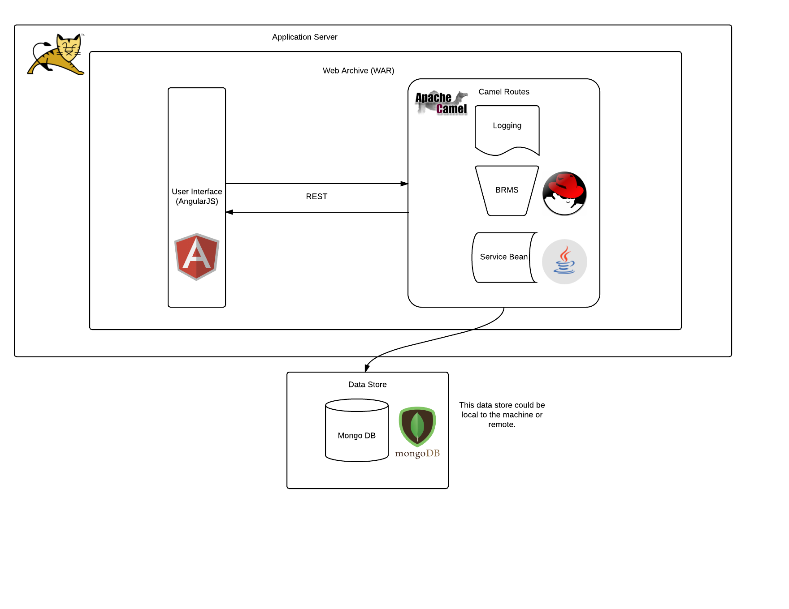

# Associate Consultant Enablement Lab

## Introduction and Schedule

Welcome to Associate Consultant Enablement (ACE)! For the next week you will be participating in a mock client engaugment with your classmates. This engaugment will follow a modified SAFE sprint for 1 week and it will include the following ceremonies: 1. Sprint Planning. 2. Daily Stand Ups 3. End of Sprint Demo and 4. Retrospective. This is a team exercise and keep in mind that the whole team succeeds or fails together. We will start Day 1 off with a sprint planning which includes creating and assigning the work to each team. After planning and each subsequent day any time after lunch can be used to work on deliveries for each team. Everyday we will have a daily stand up for each team to check in on progress and present any blockers. On Friday we will have a working demo where you will present as a team to the business what work has been completed what still is outstanding.

 DAY | Activity
 ------------------- | ---------------------------
 Day 1  | Sprint Planning, Team Formation, Start Work
 Day 2  | DSU, Work Day
 Day 3  | DSU, Work Day
 Day 4  | DSU, Work Day
 Day 5  | Demo, Retrospective

## Prerequisites

Each associate participating in this enablement will need make sure that they fulfill the following Prerequisites

### Accounts

* [Red Hat Git Lab Account](https://gitlab.consulting.redhat.com)
* [Trello Account](https://trello.com)
* [Red Hat Access Portal Account](https://access.redhat.com)
* [An OpenShift Online Account](https://www.openshift.com/app/account/new) -- use your RH email address

### Installations
Each new hire will need the following installations downloaded and unzipped prior to the start of the New Hire Bootcamp.

Install				| URL
------------------------------- | ----------
Java Development Kit 8 		| [OpenJDK](http://openjdk.java.net/install/), [Oracle JDK](http://www.oracle.com/technetwork/java/javase/downloads/jdk8-downloads-2133151.html)
Apache Maven (Latest) 			| [Maven](http://maven.apache.org/download.cgi)
Git (latest)							| [Git](https://git-scm.com/downloads)
Tomcat 8.0				| [Tomcat8](https://tomcat.apache.org/download-80.cgi)
JBoss Developer Studio 9.1			| [link](https://access.redhat.com/jbossnetwork/restricted/listSoftware.html?product=jbossdeveloperstudio&downloadType=distributions)
OpenShift Command Line Tools 	| [link](https://developers.openshift.com/en/managing-client-tools.html)
MongoDB 3.2		| [Windows, OSX, RHEL](https://docs.mongodb.com/manual/tutorial/install-mongodb-on-windows/) fedora22+ (see Appendix I)
Nodejs and NPM                    	| [link](https://github.com/joyent/node/wiki/installing-node.js-via-package-manager)
Bower | Run `npm install bower -g` in a command terminal

## Welcome to ACE LAB!

Welcome new ACE associate! You have been chosen to join a team on one of our up and coming major app: ACE LAB (Awesome Corporate Event Logistic Application Brain - it's a work in progress). Below you will find some documentation on the current architecture and application state. This will serve as your reference as you are asked to work on new features during the upcoming sprint.

## Application Overview

ACE LAB is cutting edge application being developed to be the inverse ticketmaster. Instead of selling tickets we offer a consolidated management web application that enables venue owners to list their various facilites. We also allow performers or even planners to use the same tool to book the venue for their group. Our star feature is the rules engine that takes in account many things to make sure if the booking request can be fulfilled. We have just complete our POC stage and looking to quickly add value as we are looking towards an aggressive release.  

Here at ACE we value the open source model and insist all development use all open source components. Our stack uses cutting edge community projects such as Tomcat, Camel, Drools/KIE, and Spring on the backend with an Angular front end and a Mongo DB data store.  



As you can see in the diagram above the angular front end talks to the camel based back end over REST calls which will process the data and interact with the database.  
Now that you are familiar with our basic architecture let's talk about how to set up your development enviroment:

## Developer Set Guide

**This assumes you have all software from the Pre Reqs installed**

### Local Deployment outside of JDBS

* Open terminal and clone down this git repo
```
  git clone ssh://git@gitlab.consulting.redhat.com:2222/rhtconsulting/associate-consultant-enablement.git
```
* Run a maven build in order to download all dependencies into your local maven repo  
  * for local mongo run   
     'mvn clean install'
  * for the remote mongo run  
     `mvn clean install -Popenshift`
* Copy the new war into %TOMCAT_HOME%/webapps. You will find the war in a different location depending on profile:  

 Profile | WAR Location
 ---------|------------------------------
 default | associate-consultant-enablement/lab/lab-web/target  
 openshift | associate-consultant-enablement/webapps/  
 
* Start tomcat by running %TOMCAT_HOME%/bin/catalina.sh with the start flag  
`. catalina.sh start`  
* Check http://localhost:8080/ to see if the app is running correctly

### Deploying Through JDBS

* Clone down git repo into desired location  
```
  git clone ssh://git@gitlab.consulting.redhat.com:2222/rhtconsulting/associate-consultant-enablement.git
```
* Run a maven build in order to download all dependencies into your local maven repo with the openshift profile
`mvn clean install -Popenshift`

 * Start JBDS and once you have opened a workspace, click File->Import...
    * In the Import wizard, Expand the "Maven" folder, and click "Existing Maven Projects"
    * Select the directory where you cloned your nchlab repository.
    * Select all the projects in the parent directory, and complete the wizard. In the Project Editor, you should have 9 projects imported. Each of these are discussed in detail below
* Right click on the "lab" project, then click Run As->Maven Build...
* In the Build popup, enter:
 * Goals: clean install
 * Profiles: openshift
* Click 'Run' to perform the Maven build and ensure that the project build is successful.

Now let's set up a local server to test out our application.

* Make sure that you have locally installed Tomcat 8.0.x and have a local MongoDB database running.
* In the "Servers" view of JBDS, right click and click on New->Server...
* In the following dialogues, select a new Tomcat 8 server and point to the Tomcat installation on your machine.
* On the "Add and Remove" screen, add the lab-web project in the "Available" column to the "Configured" column and click finish.
* In the web.xml of the lab-web project, under the "spring.profiles.active" context-param, change "openshift" to "default" to switch the Spring profile to your local configuration.
* Right click on the lab-web project in the Project Editor and click "Properties".
* Click into the Web Project Settings Properties menu on the left and set the Context root to "/". (Without quotes)
* Start the new server by right clicking on the new server and clicking "Start"
* Point to localhost:8080/ in your web browser and you should have the application running on your local machine with a local database.

## REST API
Endpoint | Type | Body | Completed | Purpose
--------------|---------|----------|---------|-----------------------
/bookings | POST | BookingRequest as JSON | Y | Creates new booking if booking request passes validation
/bookings | GET  | N/A | Y | Returns all Bookings. **To be added** Query Param: startDate, endDate,venue,performer
/bookings/{id} | GET | N/A | Y | Returns a particular bookings
/bookings/{id} | PUT | BookingRequest as JSON | **N** | Updates booking if request passes validation
/bookings/{id} | DELETE | N/A | Y | Deletes particular bookings
/venues | GET | N/A | Y | Gets all venues **To be added** Query Param: city, capacity, Type
/venues | POST | Venue as JSON | Y | Creates new venue
/venues/{id} | GET | N/A | Y | Returns particular venues
/venues/{id} | PUT | Venue as JSON | **N** | Updates venue
/venues/{id} | DELETE | N/A | Y | Delete particular venue **NOTE: This does a complete delete it does not update any bookings associated with the venue**  
/performancetypes | GET | N/A | Y | Retrieves add possible performance types


### Payloads for REST

#### BookingRequest
```
{
   "venueName": "boo",
   "performer": {
     "name": "Bob",
     "description": null,
     "type": "COMIC"
   },
   "open": "2016-05-30T18:00:00.000Z",
   "close": "2016-05-30T20:00:00.000Z"
}
```
#### Venue
```
{
   "name": "boo34",
   "city": "New York, City",
   "capacity": 1000000,
   "accomodations": [
     "COMIC"
   ]
 }
 ```

## Maven Modules

### lab-domain

Dependencies : none within the web app  
Test : No Tests in domain  

This module carries all of the simple Java object sometimes referred to as POJOs (Plain Old Java Objects). This module is the building block for ever other module and provides the common object to communicate with. There are no tests in this module

### lab-dao

Dependencies : lab-domain  
Tests : None but this is bad practice  

DAO stands for Data Access Object these are classes that take care of our interactions with the database. For this application we have relied heavily on a Spring project called Spring Data which analyzes
Pojos and interfaces and automatically builds the appropriate queries. We have 2 mongo collections for this project one for Venues and one for Bookings. We have a third repo and it is used for queries that require a join across Venue and Booking.

### lab-knowledge

Dependencies: lab-domain  
Tests : None  

This is a module completely devoted to the business knowledge being used to determine if a booking request could be valid. In BRMS 6+ a knowledge base (or collection of particular set of business rules and processes) is kept static during the application lifecycle and gets deployed in "knowledge" jar or kjar. To upgrade to a new version of the kjar you simply remove it and replace it with another. These rules are not tested within this jar as it essentially only holds resources. They are tested in the module that will eventually run these rules.

### lab-test-harness

Dependencies: lab-domain, lab-dao  
Tests : None - this module holds no real logic  

This module includes mocked out repositories to be used in test scenarios when access to a full db is not required. It is often good practice to build a seperate module out to house common test components that will be reused over many modules but will not be included for runtime deployment.

### lab-kie-services

Dependencies: lab-domain, lab-dao, lab-knowledge, lab-test-harness  
Tests : RunCukesTest, RunTags  

This module contains the actual execution logic for the booking validation rules. As such this module also includes cucumber scenarios to test the logic contained in the kjar. For an introduction to cucumber see Appendix II. The two important classes are RunCukesTest and RunTags. Tags will run any thing tagged with @wip, CukesTest will run anything not marked as @not_implemented.

### lab-camel-services

Dependencies: lab-dao,lab-domain,lab-kie-services(kie-knowledge)  
Tests : CamelServicesTest  

This is the meat of the back-end. This holds the camel routes which listen on REST endpoints to the front end. There are a few files of note.   

File | Description
------------|-----------------------
LabRouteBuilder.java | Camel Route Builder. This class defines all of the routes including the Rest Endpoints.
BookingReqestServiceImpl | This is a service class that is used as the logic to do things such as access the dao layer and run the correct rules
camel-beans.xml | This is a spring xml class that defines the beans to be consumed and used by the routes. Note the various profiles that indicate which database to use.
camel-context.xml | This is the file the war will eventually read from in order to set up the various classes and endpoints.

### lab-web

Dependencies: lab-domain, lab-dao, lab-camel-services  

This module is what creates the war and includes all front end code under the resources. The Front End is built with Angular and utilizes several javascript technologies including Node and UI-Bootstrap. There is a push for more UI experience in Red Hat, and as a result this lab will be fairly Front End intensive.

For more information check out "lab/lab-web/src/main/webapp/README.md".


## Appendix I: Installing Mongo 3.2 on Fedora 22+

* Add mongo repos to dnf  
```
sudo dnf config-manager --add-repo http://repo.mongodb.org/yum/redhat/7/mongodb-org/3.2/x86_64/
```
* Install with dnf  
```
sudo dnf install mongodb-org --nogpgcheck
```
* Check to make sure it is installed properly. Should read like this:  
```
[cfrieden@localhost lab]$ mongod --version  
db version v3.2.6  
git version: 05552b562c7a0b3143a729aaa0838e558dc49b25  
OpenSSL version: OpenSSL 1.0.1e-fips 11 Feb 2013  
allocator: tcmalloc  
modules: none  
build environment:  
    distmod: rhel70  
    distarch: x86_64  
    target_arch: x86_64
```

* Start the mongo server  
```
service mongod start
```

## Appendix II : Very Brief Overview of Cucumber

##### 10,000 ft View
Behavior Driven Development (BDD) allows for a common language/framework for business and technical resources to discuss and define the behavior of a system. Common language facilitates clarity and helps relieve the risk of missed scope/erroneous estimates.

##### 1000 ft overview of Cucumber
Cucumber is a BDD tool developed as a way to use documentation of system behavior as actual tests. It takes a gherkin feature file (with Given, When, Then scenarios) and uses a Step definition class as code to run it. The scenarios act as living documentation as it provides clear specific examples of the behavior and its also used as unit and system regression tests.

##### 500ft View
Cucumber.xml - Spring File that defines the Application Context and any necessary beans  
\*Steps.java - Java code that maps to the english in the feature file  
\*.feature - Gherkin that reads almost like plain english  
Runner(Junit) - java class that pieces the code together (use these features files with this step code)  

##### 100ft View
Annotation Driven(@Given, @And, @When, @Then)  
Tests can be separated out into different runners by tags (@wip, @ignore)  
Tests only work as tests if you have Asserts in your @Then  
Reusing the same pattern in a feature files = less java code needed and faster scenario writing  
Setting up a background will allow easy base line for all scenarios in a file (think @Before in junit)  

## Appendix III : Helpful Links

[BRMS 6.1 docs](https://access.redhat.com/documentation/en-US/Red_Hat_JBoss_BRMS/)  
[Cucumber](https://cucumber.io/)  
[Camel](http://camel.apache.org/)  
[Basic Architecture of Lab Content](http://redhat.slides.com/jcohler/nchbootcamplaboverview/live#/)

## Appendix IV : Maven Profiles  

To activate different profile run maven with the -P command

Maven Profile | Description
----------------|-------------------
default | Uses a local mongo instance for data access
openshift | Uses a remotely hosted monogo database. As this is a central repository anything that you edit under this profile will be reflected in any other application connected to that database
test | Runs with an in memory database. Not recommended for anything outside of unit testing.
